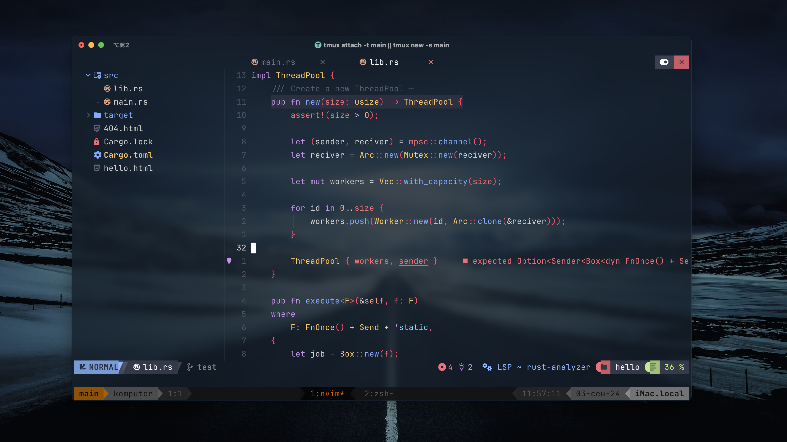

# My Dotfiles



## Features

- Alacritty
- Wezterm
- VSCode
- Tmux
- Zsh and utils

Deprecated:

- ~~Neovim~~
- ~~Hyprland~~

## Installation

1. Clone repository

```sh
git clone https://github.com/fedor81/Dotfiles.git && cd Dotfiles
```

2. Copy the contents of the `.config` folder to your `~/.config` and the contents of the `home` folder to your own home directory in `~/`.

```sh
cp -R .config/. $HOME/.config/
cp -R home/. $HOME/
```

3. Install the necessary packages from the `packages/` folder.
4. Configure some programs using `myscripts/install.sh`:

```sh
source myscripts/install.sh
```

### VSCode

My VSCode settings are located in the `.config/vscode` folder. You can move them to a different directory if you prefer.

### Neovim

My old Neovim configuration can be found in the `.config/nvim_old` directory. I am currently using VSCode.

You can install NvChad configuration:

```sh
git clone https://github.com/NvChad/starter ~/.config/nvim && nvim
```

#### Uninstall

```sh
# Linux / MacOS (unix)
rm -rf ~/.config/nvim
rm -rf ~/.local/state/nvim
rm -rf ~/.local/share/nvim
```

### NixOS

Create symlink:

```sh
sudo ln -sf $(pwd)/nixos/configuration.nix /etc/nixos/configuration.nix
```
