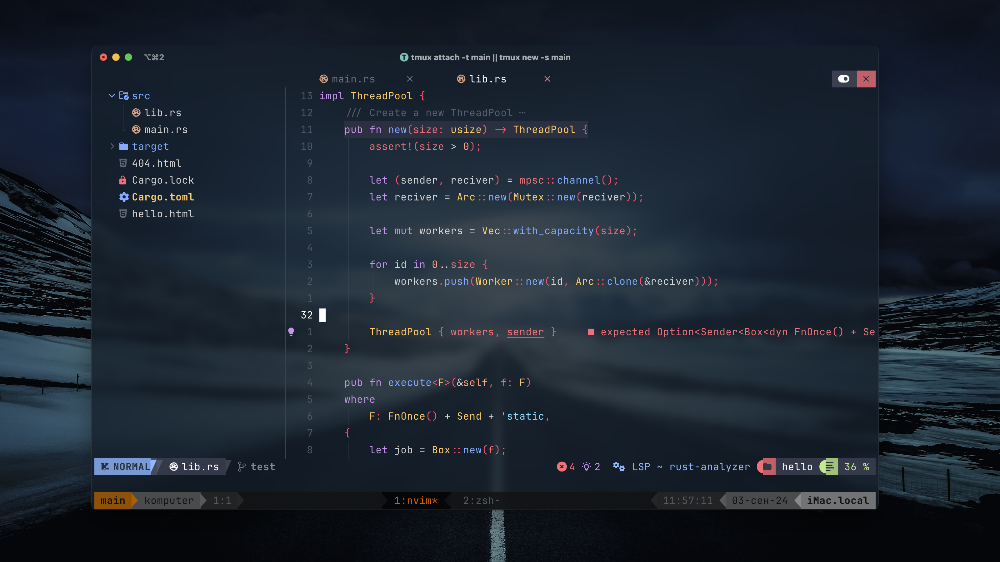

## My Dotfiles



## Features
- Neovim config(based on NvChad)
- Tmux config
- Zsh
- Alacritty
- Hyprland config

## Installation
Install `zsh`. Then install `oh-my-zsh`

```sh -c "$(curl -fsSL https://raw.githubusercontent.com/ohmyzsh/ohmyzsh/master/tools/install.sh)"```

You can install my configuration using the script `myscripts/install.sh`
Installation is supported only on **Arch** and **MacOS**.

```sh
git clone https://github.com/fedor81/Dotfiles.git
chmod +x Dotfiles/myscripts/install.sh
Dotfiles/myscripts/install.sh
```

To Intall Hyprland, use `install.sh --hypr` on Arch

##### To update, use `myscripts/update.sh`


### You can only install neovim config.

 > Install requires Neovim 0.9+. Always review the code before installing a configuration.

Clone the repository and install the plugins:

```sh
git clone https://github.com/fedor81/Dotfiles.git ~/.config/fedor81/Dotfiles
NVIM_APPNAME=fedor81/Dotfiles/.config/nvim nvim --headless "+Lazy! sync" +qa
```
 This section was generated by [Dotfyle](https://dotfyle.com)
